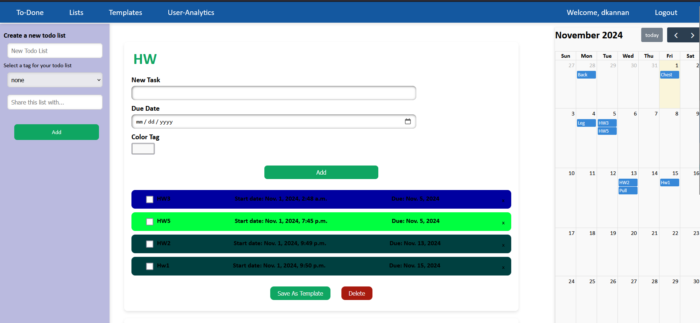
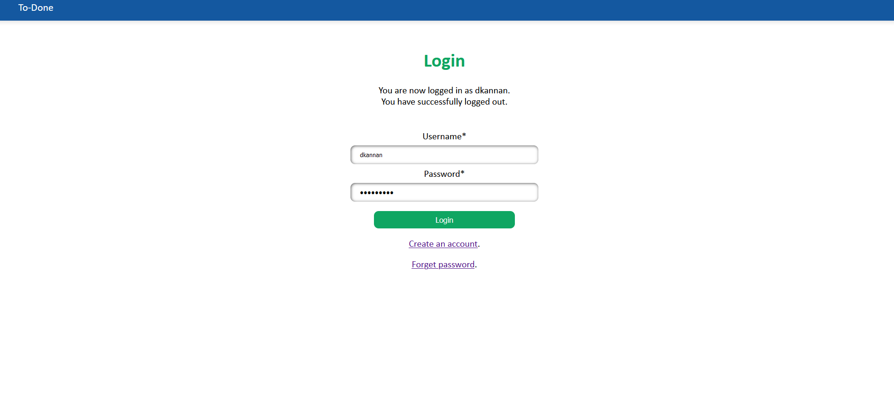
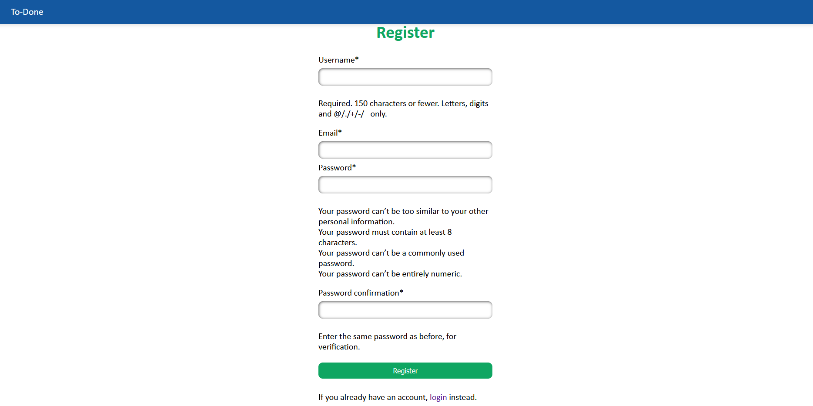
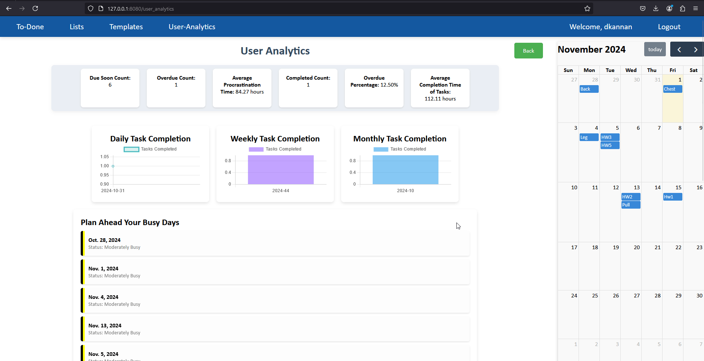

  

# The Only Todo List You Need

## TaskMaster

TaskMasterPro is a powerful, easy-to-use, and flexible to-do list application designed for busy professionals, students, and anyone looking to stay organized. With a sleek web interface, you can manage your tasks from any device. Access a comprehensive library of templates to get started quickly or customize your list to fit specific needs. With innovative features like shared lists, intelligent task analysis, and real-time alerts, you’ll never miss a deadline again!

### Watch this video to know more about TaskMasterPro 2.0

https://drive.google.com/file/d/16slSsPs1yCkgR6VO1seG3Fy4EdmboAFv/view?usp=sharing

### Watch below video to know more about the original TaskMasterPro

## Contents

 * [Why?](#why)
 * [Features](#key-features-last-version)
 * [New Features](#new-features)
 * [Upcoming Features](#upcoming-features)
 * [Quick Start](#quick-start)
 * [Documentation](#documentation)
 * [Want to contribute?](#want-to-contribute)
 * [License](#license)
 * [Developers](#developers-new-version)

## Why?

We aimed to build something that meets the following criteria:

+ *Purposeful*: An app that fulfills a real need in task management, offering unique tools for productivity.
+ *Scalable*: Designed to work efficiently with a core set of features and expand easily with new functionalities.
+ *Collaborative*: TaskMasterPro's modular structure allows for contributions from multiple developers simultaneously, encouraging teamwork and seamless integration of new features.
+ *Comprehensive*: A project that leverages key Software Engineering practices, from web development and database management to UI/UX design and agile project management.

TaskMasterPro stands out as a functional, efficient to-do app that integrates essential web technologies and practices, all while fostering a productive and collaborative environment.

## Key Features (Last Version)
 * *Register*: Create an account to save and manage your to-do lists across devices.
 * *Login*: Log in securely to access your lists and settings from any device. 
 * *Create, Update, Delete Todo Lists*: Add, modify, or remove lists with a simple interface.
 * *Quickly Create Todo Lists From Templates*: Select from predefined templates to quickly build structured lists.
 * *Custom Templates*: Save time by creating reusable templates tailored to your needs.
 * *Shared List*: Collaborate with others by sharing specific lists for joint task management.
 * *Due Date and Color Tagging*: Assign due dates and color-coded tags to tasks for better organization and urgency recognition.
 * *Tag-based Grouping*: Use customizable tags to group and organize tasks, projects, or lists.

## New Features

* *User Productivity Analysis*: Get insights into your productivity trends over time.
* *Task Analysis*: View detailed analytics on task completion, pending tasks, and more.
* *Customized Color Tags*: Personalize tags for a more visual, engaging to-do list experience.
* *Due Date Alerting Mechanism*: Receive timely alerts for upcoming or overdue tasks.
* *Advanced Scheduler*: Plan tasks with complex scheduling options for improved time management.
* *Calendar Dashboard*: Visualize tasks and deadlines on a calendar to track deadlines and progress effectively.

## Upcoming Features
* *Task Cloning for Repeatable Routines*: Add a "Clone Task" option for quick duplication of recurring tasks with similar settings.
* *Quick Task Ratings*: Prompt users to rate tasks on importance, ease, and satisfaction after completion for personalized insights.
* *AI-Driven Next Task Suggestion*: Recommend the next best task based on urgency, priority, and user preferences.
* *Daily Focus Theme*: Set daily themes (e.g., "Wellness Wednesdays") to help users concentrate on specific task types.
* *Gamified Achievements and Badges*: Reward users with badges like "Task Streaker" and "Deadline Conqueror" for motivational milestones.
## Quick Start

 * [Download](https://www.python.org/downloads/release/python-380/) and install Python 3.8.0 or higher.
 * [Install](https://docs.djangoproject.com/en/4.1/topics/install/) Django 4.1.
 * Clone the repository:
    bash
    $ git clone https://github.com/SoftwareEngineeringNCSU101/TaskMasterPro.git
    
 * Run migrations:
    bash
    $ python manage.py migrate
    
 * Start the app:
    bash
    $ python manage.py runserver 8080
    
 * Open your browser at http://127.0.0.1:8080 to explore TaskMasterPro.

## Documentation
Explore the full documentation [here](https://drive.google.com/file/d/1dTMPA3Mq1Ou7XR9jDfKYhGOni98FMxIN/view) for details on installation, usage, and API options.

## Features

### Register

    

### Login, Forget Password

     

### Manage Todo List

    
     
    

### User Analytics

    

## Want to Contribute?

Interested in contributing? See our [Contributing Guide](CONTRIBUTING.md) for ways to get started. Not sure where to start? Check out our [good first issues](https://github.com/SoftwareEngineeringNCSU101/TaskMasterPro/issues/4) or open an [Issue](https://github.com/SoftwareEngineeringNCSU101/TaskMasterPro/issues) to let us know your ideas or report any bugs.

## License

This project is licensed under the MIT License. For more details, view the [LICENSE](https://github.com/SoftwareEngineeringNCSU101/TaskMasterPro/blob/main/LICENSE) file.

## Developers (New Version)

<table>
  <tr>
    <td align="center"><a href="https://github.com/dineshkannan010"> <b>Dinesh Kannan</b></a></td>
    <td align="center"><a href="https://github.com/Harshvardhan14"> <b>Harshvardhan Patil</b></a> </td>
    <td align="center"><a href="https://github.com/SakshiPhatak"> <b>Sakshi Phatak</b></a> </td>

  </tr>
</table>

## Developers (Last Version)

* Shahnewaz Leon (sleon3@ncsu.edu)
* Dong Li (dli35@ncsu.edu)
* Cheng-Yun Kuo (ckuo3@ncsu.edu)
* Drew Commings (docummin@ncsu.edu)